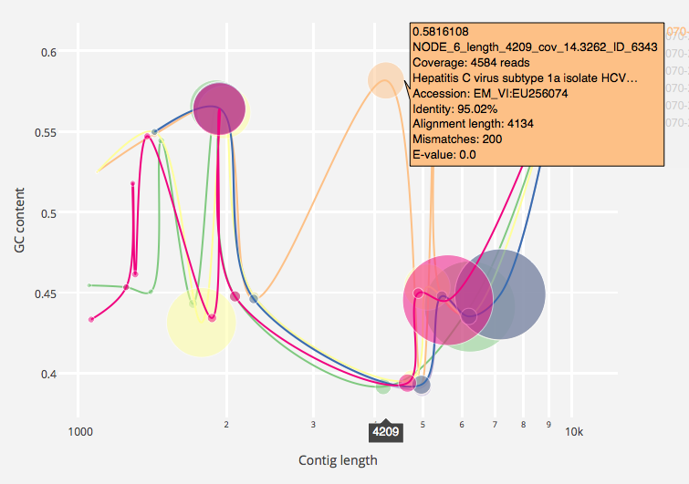

# sparNA  

sparNA is a pipeline for assembling high depth paired-end sequencing reads from diverse viruses such as HIV and HCV. *In silico* normalisation can improve the contiguity of such assemblies, but should be parameterised on a per-sample basis for best results. sparNA accepts paired Illumina reads and lists of normalisation target coverage `c` and normalisation `k` values. Input reads are optionally trimmed and normalised in parallel using Khmer's `normalize-by-median.py` according to each combination of `c` and `k`, and each set of reads is subsequently assembled with SPAdes. BLAST results for the top n contigs in each assembly are retrieved using the EBI BLAST web service and an interactive plot of the assemblies is generated for scrutiny by the user. The default BLAST db is the complete EBI sequence release `em_rel`, but for faster searches, the smaller viral `em_rel_vrl` db may be used.  
  
  
  
Feel free to get in touch via b|at|bede|dot|im or [Twitter](https://twitter.com/beconstant) 

## Dependencies  
Tested on OS X. Should work fine on Linux.  
Requires: Java, **Python 3.5**, SPAdes, Bowtie2, Samtools, VCFtools, BCFtools, SeqTK, Argh, Biopython, Khmer, Pandas, Plotly  
Trimmomatic (jar file) is bundled inside `res/`  

### Mac OS X
Using Homebrew and pip is the easiest approach
- `brew tap homebrew/homebrew-science`
- `brew install python3 spades bowtie2 samtools vcftools bcftools seqtk`
- `pip3 install argh biopython khmer pandas plotly`  
Finally, sign up for a Plotly account and set your [API key](https://plot.ly/settings/api)  
- `python3 -c "import plotly; plotly.tools.set_credentials_file(username='USERNAME', api_key='API_KEY')"`  

## Usage
Unzip `sparna.py` and the `res/` directory
Ensure dependencies are discoverable inside $PATH  
N.B. Specify reads using absolute paths  
Having issues? Set log level to `INFO` for verbose output  


```
./sparna.py --trimming --blast
	--fwd-fq /Users/Bede/Datasets/hcv/170-264_r2_Cap1_F.fastq \
	--rev-fq /Users/Bede/Datasets/hcv/170-264_r2_Cap1_R.fastq \
	--norm-c-list 1,5,20 \
	--norm-k-list 21,31 \
	--asm-k-list 21,33,55,77 \
	--min-len 1000 \
	--blast-max-seqs 5 \
	--threads 12
Importing reads...
	Done
Trimming...
	Done
Normalising...
	Normalising norm_c=1, norm_k=21
	Normalising norm_c=5, norm_k=21
	Normalising norm_c=20, norm_k=21
	Normalising norm_c=1, norm_k=31
	Normalising norm_c=5, norm_k=31
	Normalising norm_c=20, norm_k=31
	All done
Assembling...
	Assembling norm_c=1, norm_k=21, asm_k=21,33,55,77
	Assembling norm_c=5, norm_k=21, asm_k=21,33,55,77
	Assembling norm_c=20, norm_k=21, asm_k=21,33,55,77
	Assembling norm_c=1, norm_k=31, asm_k=21,33,55,77
	Assembling norm_c=5, norm_k=31, asm_k=21,33,55,77
	Assembling norm_c=20, norm_k=31, asm_k=21,33,55,77
	All done
Aligning to assemblies... (Bowtie2)
	Done (bowtie2-build)
	Done (bowtie2)
	Done (grep)
	Done (samtools)
	Done (samtools)
	Done (samtools)
	Done (bowtie2-build)
	Done (bowtie2)
	Done (grep)
	Done (samtools)
	Done (samtools)
	Done (samtools)
	Done (bowtie2-build)
	Done (bowtie2)
	Done (grep)
	Done (samtools)
	Done (samtools)
	Done (samtools)
	Done (bowtie2-build)
	Done (bowtie2)
	Done (grep)
	Done (samtools)
	Done (samtools)
	Done (samtools)
	Done (bowtie2-build)
	Done (bowtie2)
	Done (grep)
	Done (samtools)
	Done (samtools)
	Done (samtools)
	Done (bowtie2-build)
	Done (bowtie2)
	Done (grep)
	Done (samtools)
	Done (samtools)
	Done (samtools)
BLASTing assemblies...
	Assembly 170-264_r2_Cap1_F.norm_k21c1.asm_k21k33k55k77
		Query NODE_5_length_1493_cov_1.14619_ID_5571
		Query NODE_3_length_2827_cov_3.55927_ID_5567
		Query NODE_4_length_2126_cov_5.21816_ID_5569
		Query NODE_2_length_6124_cov_1.94459_ID_5565
		Query NODE_1_length_7285_cov_4.54065_ID_5563
		Query NODE_6_length_1208_cov_0.552702_ID_5573
	Assembly 170-264_r2_Cap1_F.norm_k21c20.asm_k21k33k55k77
		Query NODE_3_length_5463_cov_4.18622_ID_5141
		Query NODE_6_length_1372_cov_1.81004_ID_5147
		Query NODE_4_length_2827_cov_22.1709_ID_5143
		Query NODE_5_length_1879_cov_28.9434_ID_5145
		Query NODE_2_length_6334_cov_3.86125_ID_5139
		Query NODE_1_length_9409_cov_28.0171_ID_5137
	Assembly 170-264_r2_Cap1_F.norm_k21c5.asm_k21k33k55k77
		Query NODE_4_length_2827_cov_7.84873_ID_5065
		Query NODE_2_length_6256_cov_3.54038_ID_5061
		Query NODE_5_length_1838_cov_12.2061_ID_5067
		Query NODE_1_length_9408_cov_11.3773_ID_5059
		Query NODE_3_length_5463_cov_3.31638_ID_5063
		Query NODE_6_length_1372_cov_1.81004_ID_5069
	Assembly 170-264_r2_Cap1_F.norm_k31c1.asm_k21k33k55k77
		Query NODE_5_length_2536_cov_1.05002_ID_5217
		Query NODE_6_length_1208_cov_0.627989_ID_5219
		Query NODE_2_length_3415_cov_2.37519_ID_5211
		Query NODE_4_length_2827_cov_5.44618_ID_5215
		Query NODE_1_length_9401_cov_6.67975_ID_5209
		Query NODE_3_length_3036_cov_3.98717_ID_5213
	Assembly 170-264_r2_Cap1_F.norm_k31c20.asm_k21k33k55k77
		Query NODE_3_length_5463_cov_4.18622_ID_5341
		Query NODE_6_length_1372_cov_1.81004_ID_5347
		Query NODE_5_length_1879_cov_35.3879_ID_5345
		Query NODE_4_length_2827_cov_26.0007_ID_5343
		Query NODE_2_length_6333_cov_3.86125_ID_5339
		Query NODE_1_length_9409_cov_31.276_ID_5337
	Assembly 170-264_r2_Cap1_F.norm_k31c5.asm_k21k33k55k77
		Query NODE_3_length_5463_cov_3.5362_ID_5071
		Query NODE_6_length_1372_cov_1.81004_ID_5077
		Query NODE_5_length_1879_cov_16.9462_ID_5075
		Query NODE_4_length_2827_cov_10.904_ID_5073
		Query NODE_2_length_6257_cov_3.84027_ID_5069
		Query NODE_1_length_9408_cov_14.3683_ID_5067
https://plot.ly/~bede/36
Wall time: 354.7s
```